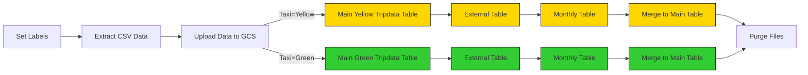

# 第二周: 工作流编排

视频资源地址：[Data Engineering Zoomcamp 2025 with Kestra - YouTube](https://www.youtube.com/playlist?list=PLEK3H8YwZn1oPPShk2p5k3E9vO-gPnUCf)

主要内容：使用kestra深入研究工作流编排。

Kestra：一个开源的，由事件驱动的编排平台。用YAML构建工作流。

---

# Course Structure

## 1. 概念：编排和Kestra

学习工作流编排的基础，其重要性以及Kestra如何建立编排环境。

### Videos

- **2.2.1 - Introduction to Workflow Orchestration**  
  [](https://youtu.be/Np6QmmcgLCs)

- **2.2.2 - Learn the Concepts of Kestra**  
  [](https://youtu.be/o79n-EVpics)

### Resources

- [Quickstart Guide](https://go.kestra.io/de-zoomcamp/quickstart)
- [Install Kestra with Docker Compose](https://go.kestra.io/de-zoomcamp/docker-compose)
- [Tutorial](https://go.kestra.io/de-zoomcamp/tutorial)
- [What is an Orchestrator?](https://go.kestra.io/de-zoomcamp/what-is-an-orchestrator)

### Quickstart

（1）通过docker启动kestra容器

```
docker run --pull=always --rm -it -p 8080:8080 --user=root \
-v /var/run/docker.sock:/var/docker.sock  \
-v /tmp:/tmp kestra/kestra:latest-full server local
```

在浏览器中输入localhost:8080 进入网页版。

（2）基本概念

workflows的三属性

- id

- namespace -命名空间

- tasks

Inputs 输入

Outputs 输出

Triggers 触发器

---

## 2.  动手编码项目：使用Kestra构建数据管道

> Video Source: [DE Zoomcamp 2.2.3 - ETL Pipelines with Postgres in Kestra - YouTube](https://www.youtube.com/watch?v=OkfLX28Ecjg&list=PLEK3H8YwZn1oPPShk2p5k3E9vO-gPnUCf&index=4)
> 
> CSV files:  [Releases · DataTalksClub/nyc-tlc-data · GitHub](https://github.com/DataTalksClub/nyc-tlc-data/releases)

开启一个postgre的容器

```
docker run -it  
-e POSTGRES_USER="kestra"  
-e POSTGRES_PASSWORD="k3str4"  
-e POSTGRES_DB="kestra"  
-v ./taxi_postgress_data:/var/lib/postgressql/data  
-p 5432:5432  
postgres
```

使用pgAdmin连接该数据库：


### 1: Flow explanation step by step


#### Variables

```
variables:
  file: "{{inputs.taxi}}_tripdata_{{inputs.year}}-{{inputs.month}}.csv"
  staging_table: "public.{{inputs.taxi}}_tripdata_staging"
  table: "public.{{inputs.taxi}}_tripdata"
  data: "{{outputs.extract.outputFiles[inputs.taxi ~ '_tripdata_' ~ inputs.year ~ '-' ~ inputs.month ~ '.csv']}}""
```

file：基于inputs中选择的出租车类型、年和月，生成CSV文件的名称，格式将会为“yellow_tripdata_2019-01.csv”

staging_table: 对给定taxi、year和month放入临时表中。

table: 指定PostgreSQL中的最终表名称，合并的数据将会存入特定出租车类型的表中，表名例如：public.green_tripdata。

data: 指提取任务生成的输出文件，用作复制任务的输入。

#### Task:Set Lables

将标签添加到流程执行中，以跟踪所选文件和出租车类型。标签是有助于组织，识别和跟踪工作流执行的元数据标签。他们可以在运行时或查看日志并监视工作流执行时提供有价值的上下文信息。

#### Task:Extract Data

```
  - id: extract
    type: io.kestra.plugin.scripts.shell.Commands
    outputFiles:
      - "*.csv"
    taskRunner:
      type: io.kestra.plugin.core.runner.Process
    commands:
      - wget -qO- https://github.com/DataTalksClub/nyc-tlc-data/releases/download/{{inputs.taxi}}/{{render(vars.file)}}.gz | gunzip > {{render(vars.file)}}
```

使用GITHUB存储库中的WGETOTORITIONA下载压缩的CSV文件，并将其解压缩并将其保存为.csv文件。

#### Task:yellow_table/green_table

```
- id: yellow_table
    runIf: "{{inputs.taxi == 'yellow'}}"
    type: io.kestra.plugin.jdbc.postgresql.Queries
    sql: |
      CREATE TABLE IF NOT EXISTS {{render(vars.table)}} (
          unique_row_id          text,
          filename                text,
          VendorID               text,

        ...
      );
```

{{render(vars.table)}}，需要利用render函数来渲染具有表达式的变量。

该表中增加两列：唯一的ID列和文件名。因此我们可以查看数据到哪个文件以及基于数据生成的唯一ID，以防止以后添加重复项。

#### Task: yellow_create_staging_table/green_create_staging_table

```
  - id: yellow_create_staging_table
    runIf: "{{inputs.taxi == 'yellow'}}"
    type: io.kestra.plugin.jdbc.postgresql.Queries
    sql: |
      CREATE TABLE IF NOT EXISTS {{render(vars.staging_table)}} (
          VendorID               text,
          tpep_pickup_datetime   timestamp,
          tpep_dropoff_datetime  timestamp,
          passenger_count        integer,

          ...
      );
```

为每月的黄色/绿色出租车数据创建一个临时表，并与CSV文件对齐。

#### Task:  truncate_table

加载新数据之前，清空临时表。

#### Task: green_copy_in_to_staging_table/yellow_copy_in_to_staging_table

```
  - id: green_copy_in_to_staging_table
    runIf: "{{inputs.taxi == 'green'}}"
    type: io.kestra.plugin.jdbc.postgresql.CopyIn
    format: CSV
    from: "{{render(vars.data)}}"
    table: "{{render(vars.staging_table)}}"
    header: true
    columns: [VendorID,lpep_pickup_datetime, ...]
```

此任务负责将提取的CSV文件中的数据复制到用于处理的临时PostgreSQL表中。

#### Task: yellow_add_unique_id_and_filename/green_add_unique_id_and_filename

```
  - id: yellow_add_unique_id_and_filename
    runIf: "{{inputs.taxi == 'yellow'}}"
    type: io.kestra.plugin.jdbc.postgresql.Queries
    sql: |
      ALTER TABLE {{render(vars.staging_table)}}
      ADD COLUMN IF NOT EXISTS unique_row_id text,
      ADD COLUMN IF NOT EXISTS filename text;

      UPDATE {{render(vars.staging_table)}}
      SET 
        unique_row_id = md5(
          COALESCE(CAST(VendorID AS text), '') ||
          COALESCE(CAST(tpep_pickup_datetime AS text), '') || 
          COALESCE(CAST(tpep_dropoff_datetime AS text), '') || 
          COALESCE(PULocationID, '') || 
          COALESCE(DOLocationID, '') || 
          COALESCE(CAST(fare_amount AS text), '') || 
          COALESCE(CAST(trip_distance AS text), '')      
        ),
        filename = '{{render(vars.file)}}';
```

通过为每一行生成唯一的哈希ID并存储文件名来更新表。

#### Task: yellow_merge_data/green_merge_data

```
  - id: yellow_merge_data
    runIf: "{{inputs.taxi == 'yellow'}}"
    type: io.kestra.plugin.jdbc.postgresql.Queries
    sql: |
      MERGE INTO {{render(vars.table)}} AS T
      USING {{render(vars.staging_table)}} AS S
      ON T.unique_row_id = S.unique_row_id
      WHEN NOT MATCHED THEN
        INSERT (
          unique_row_id, filename, VendorID, tpep_pickup_datetime, tpep_dropoff_datetime,
          passenger_count, trip_distance, RatecodeID, store_and_fwd_flag, PULocationID,
          DOLocationID, payment_type, fare_amount, extra, mta_tax, tip_amount, tolls_amount,
          improvement_surcharge, total_amount, congestion_surcharge
        )
        VALUES (
          S.unique_row_id, S.filename, S.VendorID, S.tpep_pickup_datetime, S.tpep_dropoff_datetime,
          S.passenger_count, S.trip_distance, S.RatecodeID, S.store_and_fwd_flag, S.PULocationID,
          S.DOLocationID, S.payment_type, S.fare_amount, S.extra, S.mta_tax, S.tip_amount, S.tolls_amount,
          S.improvement_surcharge, S.total_amount, S.congestion_surcharge
        );
```

使用unique_row_id将每月数据从临时表合并到yellow_table/green_table中

- type: io.kestra.plugin.jdbc.postgresql.cerqueries：在PostgreSQL数据库上执行SQL查询。

```
MERGE INTO {{render(vars.table)}} AS T
USING {{render(vars.staging_table)}} AS S
ON T.unique_row_id = S.unique_row_id
```

- 合并为t：将每月表（s）的数据合并到最终表（t）中。在t.unique_row_id上= s.unique_row_id：基于unique_row_id列与源（s）和target（t）的行匹配。如果在t中存在具有相同唯一的_row_id的记录，则将忽略它。

- WHEN NOT MATCHED THEN: Ensures that only records that do not already exist in T are inserted.  当不匹配时：确保仅插入t中尚未存在的记录。INSERT VALUES: Inserts all relevant columns from the monthly table,  
  插入值：从每月表中插入所有相关列，

#### Task: purge_files

此任务可确保在流量执行过程中下载或生成的任何文件一旦不再需要，就可以删除。

#### Plugin Defaults

所有PostgreSQL任务都使用预配置的连接：

URL: jdbc:postgresql://host.docker.internal:5433/ny_taxi Username: kestra Password:k3str4

### 2: Execute flow

Try the flow 02_postgres_taxi.


### 3:check PgAdmin


## Load Data to Local Postgres with backfill

> video source:[[DE Zoomcamp 2.2.4 - Manage Scheduling and Backfills with Postgres in Kestra - YouTube](https://www.youtube.com/watch?v=_-li_z97zog)]()

> The flow code: 


### 1:Flow explanation

**concurrency**

整个flow中只有一张临时表，智能每次只执行一个操作，防止多个进程写不同月份到同一个表中。

**Triggers: green_schedule**

Cron表达式：“ 0 9 1 * *”：每个月的第一天在上午9:00运行。

**Triggers: yellow_schedule**

Cron表达式：“ 0 10 1 * *”：每月的第一天在上午10:00运行。

### 2:Execute flow

Select triggers --> Backfill executions


### 3: Check PgAdmin

---

## ETL Pipelines in Kestra: Google Cloud Platform

Now that you've learned how to build ETL pipelines locally using Postgres, we are ready to move to the cloud. In this section, we'll load the same Yellow and Green Taxi data to Google Cloud Platform (GCP) using: 

1. Google Cloud Storage (GCS) as a data lake  
2. BigQuery as a data warehouse.

### Videos

- **2.2.6 - Create an ETL Pipeline with GCS and BigQuery in Kestra**  
  [](https://youtu.be/nKqjjLJ7YXs)
- **2.2.7 - Manage Scheduling and Backfills using BigQuery in Kestra**   
  [](https://youtu.be/DoaZ5JWEkH0)
- **2.2.8 - Transform Data with dbt and BigQuery in Kestra**   
  [](https://youtu.be/eF_EdV4A1Wk)

### Setup Google Cloud Platform (GCP)

Before we start loading data to GCP, we need to set up the Google Cloud Platform. 

First, adjust the following flow [`04_gcp_kv.yaml`](flows/04_gcp_kv.yaml) to include your service account, GCP project ID, BigQuery dataset and GCS bucket name (_along with their location_) as KV Store values:

- GCP_CREDS
- GCP_PROJECT_ID
- GCP_LOCATION
- GCP_BUCKET_NAME
- GCP_DATASET.

> [!WARNING]  
> The `GCP_CREDS` service account contains sensitive information. Ensure you keep it secure and do not commit it to Git. Keep it as secure as your passwords.

### Create GCP Resources

If you haven't already created the GCS bucket and BigQuery dataset in the first week of the course, you can use this flow to create them: [`05_gcp_setup.yaml`](flows/05_gcp_setup.yaml).

### GCP Workflow: Load Taxi Data to BigQuery



The flow code: [`06_gcp_taxi.yaml`](flows/06_gcp_taxi.yaml).

### GCP Workflow: Schedule and Backfill Full Dataset

We can now schedule the same pipeline shown above to run daily at 9 AM UTC for the green dataset and at 10 AM UTC for the yellow dataset. You can backfill historical data directly from the Kestra UI.

Since we now process data in a cloud environment with infinitely scalable storage and compute, we can backfill the entire dataset for both the yellow and green taxi data without the risk of running out of resources on our local machine.

The flow code: [`06_gcp_taxi_scheduled.yaml`](flows/06_gcp_taxi_scheduled.yaml).

### GCP Workflow: Orchestrate dbt Models

Now that we have raw data ingested into BigQuery, we can use dbt to transform that data. The flow will sync the dbt models from Git to Kestra and run the `dbt build` command to build the models:


The flow code: [`07_gcp_dbt.yaml`](flows/07_gcp_dbt.yaml).

---

## Bonus: Deploy to the Cloud

Now that we've got our ETL pipeline working both locally and in the cloud, we can deploy Kestra to the cloud so it can continue to orchestrate our ETL pipelines monthly with our configured schedules, We'll cover how you can install Kestra on Google Cloud in Production, and automatically sync and deploy your workflows from a Git repository.

### Videos

- **2.2.9 - Deploy Workflows to the Cloud with Git**   
  [](https://youtu.be/l-wC71tI3co)

Resources

- [Install Kestra on Google Cloud](https://go.kestra.io/de-zoomcamp/gcp-install)
- [Moving from Development to Production](https://go.kestra.io/de-zoomcamp/dev-to-prod)
- [Using Git in Kestra](https://go.kestra.io/de-zoomcamp/git)
- [Deploy Flows with GitHub Actions](https://go.kestra.io/de-zoomcamp/deploy-github-actions)

## Additional Resources 📚

- Check [Kestra Docs](https://go.kestra.io/de-zoomcamp/docs)
- Explore our [Blueprints](https://go.kestra.io/de-zoomcamp/blueprints) library
- Browse over 600 [plugins](https://go.kestra.io/de-zoomcamp/plugins) available in Kestra
- Give us a star on [GitHub](https://go.kestra.io/de-zoomcamp/github)
- Join our [Slack community](https://go.kestra.io/de-zoomcamp/slack) if you have any questions
- Find all the videos in this [YouTube Playlist](https://go.kestra.io/de-zoomcamp/yt-playlist)

# 

---

# Community notes

Did you take notes? You can share them by creating a PR to this file! 

* [Notes from Manuel Guerra)](https://github.com/ManuelGuerra1987/data-engineering-zoomcamp-notes/blob/main/2_Workflow-Orchestration-(Kestra)/README.md)
* [Notes from Horeb Seidou](https://spotted-hardhat-eea.notion.site/Week-2-Workflow-Orchestration-17129780dc4a80148debf61e6453fffe)
* Add your notes above this line

---

# Previous Cohorts

* 2022: [notes](../../2022/week_2_data_ingestion#community-notes) and [videos](../../2022/week_2_data_ingestion/)
* 2023: [notes](../../2023/week_2_workflow_orchestration#community-notes) and [videos](../../2023/week_2_workflow_orchestration/)
* 2024: [notes](../../2024/02-workflow-orchestration#community-notes) and [videos](../../2024/02-workflow-orchestration/)
